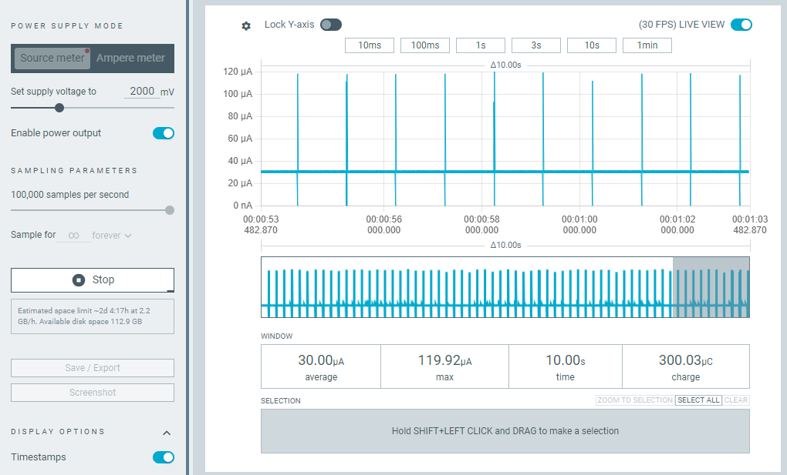
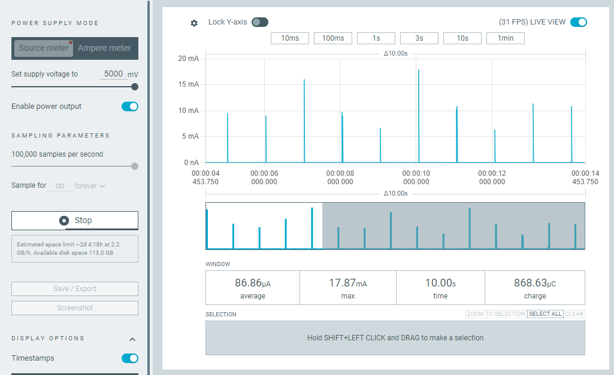

# DS1302 Real-Time Clock (RTC) C Driver

## Overview
The **DS1302** is a real-time clock (RTC) module that keeps track of time and date. This C driver allows communication with the DS1302 using a microcontroller over a **3-wire SPI interface** (CE, SCLK, I/O).

## Features
- Read and write **time** (HH:MM:SS)
- Read and write **date** (DD/MM/YYYY, Day of the week)

## Hardware Requirements
- **Microcontroller** (e.g., STM32, AVR, ESP32, etc.)
- **DS1302 RTC module**
- **3 GPIO pins** for communication

## Example
- Currently support STM32 example, tested on STM32F103C6T6
The example set an initial Date and time and them print it out through UART.

## Wiring Diagram
For example STM32F103C6T6,
you can find the information in inc/board_config.h
or belows:

| DS1302 Pin | MCU Pin |
|------------|---------|
| CE (RST)   | GPIO_A3 |
| SCLK       | GPIO_A1 |
| I/O        | GPIO_A2 |
| UART (TX)  | GPIO_A9 |
| VCC        | 3.3V/5V |
| GND        | GND     |

## Installation
1. **Copy driver files** (`ds1302.c`, `ds1302_hw.c` and `ds1302.h`, `ds1302_hw.h`) into your project.
2. **Include the header file** in your source code:
   ```c
   #include "ds1302.h"
   ```
## Usage

### Initialize hardware abstraction for ds1302
```c
void ds1302_com_init(void)
{
  ds1302_hw_ops_t ds1302_hw = {
      .rst_write = hal_gpio_ds1302_rst_write,
      .clk_write = hal_gpio_ds1302_clk_write,
      .dat_set_mode = hal_gpio_ds1302_dat_set_mode,
      .dat_write = hal_gpio_ds1302_dat_write,
      .dat_read = hal_gpio_ds1302_dat_read,
      .delay_us = sw_udelay,
  };
  ds1302_set_hw_spec(&ds1302_hw);
}

int hal_gpio_ds1302_rst_write(uint8_t val)
{
  HAL_GPIO_WritePin(DS1302_RST_PORT, DS1302_RST_PIN, val);
  return 0;
}
...

```
### Initialize MCU hardwares
```c
  HAL_Init();
  SystemClock_Config();
  MX_GPIO_Init();
  MX_USART1_UART_Init();
  ds1302_com_init();
```


### Set Time & Date
```c
  datetime_t set_time = DATETIME_INIT(30, 59, 23, 31, 12, 7, 1); /// 30 secs to happy new year!!!
  ds1302_en_write();
  ds1302_write_time(&set_time, REG_WRITE_BURST);
```

### Read Time & Date
```c
    HAL_Delay(1000);

    /* Read all of the time variables*/
    ds1302_read_time(&time_keeper, REG_READ_BURST);

    hal_uart_prinf("%d:%d:%d:%d:%d:%d:%d \n",
                   time_keeper.seconds,
                   time_keeper.minutes,
                   time_keeper.hours,
                   time_keeper.date,
                   time_keeper.months,
                   time_keeper.weekday,
                   time_keeper.years);
```

### Results:

```c
55:0:0:1:1:1:2 
56:0:0:1:1:1:2 
57:0:0:1:1:1:2 
58:0:0:1:1:1:2 
59:0:0:1:1:1:2 
0:1:0:1:1:1:2 
1:1:0:1:1:1:2 
2:1:0:1:1:1:2 
3:1:0:1:1:1:2 
4:1:0:1:1:1:2 
5:1:0:1:1:1:2 
6:1:0:1:1:1:2 
7:1:0:1:1:1:2 
9:1:0:1:1:1:2 
10:1:0:1:1:1:2 
11:1:0:1:1:1:2 
12:1:0:1:1:1:2 
13:1:0:1:1:1:2 
14:1:0:1:1:1:2 
15:1:0:1:1:1:2 
16:1:0:1:1:1:2 
```


## Notes
- DS1302 operates at **3.3V or 5V**.
- connect a **backup battery** to maintain time when power is lost.

## Power Consumption experiment
- Measurement device: Nordic PPK2
- Condition: Input supply to VCC2 (main power souce)
- Result: 30uA @ 2V (datasheet: 25uA) and 88uA @5V (datasheet: 80uA)




## License
This driver is open-source and can be used freely in any project.
---

**Author:** Binh Pham
**Contact me**: You can find my contact @ https://github.com/ch-binh
**Version:** 1.0  
**Last Updated:** March 2025

